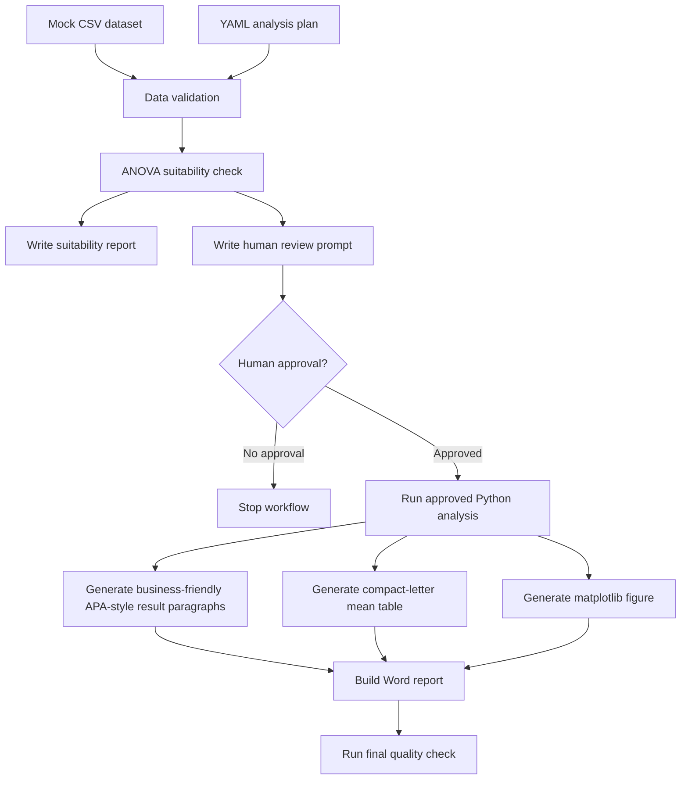

# Workflow Overview

## Core Principle

The workflow separates statistical decision support from formal statistical reporting.

The system can inspect data, run diagnostic checks, and recommend an analysis path. It must not generate final statistical conclusions until a human reviewer confirms the path.

This design makes the AI workflow a reproducible guardrail, not a replacement for researcher judgment.

## Flow

## Inputs

- `data/employee_ai_support_mock.csv`
- `config/analysis_plan.yaml`
- `config/statistical_decision_rules.yaml`
- `config/human_review_decision.yaml` after reviewer approval

## Guardrail Outputs Before Approval

- `outputs/anova_suitability_check.md`
- `outputs/human_review_required.md`

No APA conclusion, formal table, figure, or Word report should be generated before approval.

## Suitability Checks

The MVP checks:

- structure: grouping variable, valid group count, dependent variable presence, numeric dependent variables, unique participant IDs, and repeated/nested design hints
- missingness: overall and group-level missingness for key variables
- sample size: valid n per group and max/min group n ratio
- outliers: IQR-rule outlier rate and group concentration
- normality: group-level Shapiro-Wilk tests with skewness and kurtosis
- variance homogeneity: median-centered Levene's test and max/min variance ratio

## Decision Paths

- `classical_anova_recommended`: ordinary one-way ANOVA plus Tukey HSD.
- `welch_anova_recommended`: Welch ANOVA plus Games-Howell post hoc tests.
- `diagnostic_only`: report diagnostics only; do not generate formal conclusions.
- `stop_analysis`: stop because the plan or data is outside the one-way ANOVA MVP.

The classical vs Welch switch is driven mainly by variance homogeneity. Normality warnings are reported for review but usually do not determine the classical vs Welch path by themselves.

## Reporting Outputs After Approval

- `outputs/analysis_results.json`
- `outputs/mean_table_compact_letters.csv`
- `outputs/figure_combined_raincloud.png`
- `outputs/business_friendly_report_zh.md`
- `outputs/final_report.docx`
- `outputs/quality_check.md`

The MVP uses post-hoc comparisons to generate compact letter displays, significance brackets, and result paragraphs. It does not expose a separate full post-hoc comparisons table in the first public showcase version.

## Python-Only Implementation

The MVP uses Python packages only:

- `pandas` and `numpy` for data preparation
- `scipy` for Shapiro-Wilk and Levene's test
- `statsmodels` for classical ANOVA and Tukey HSD
- `pingouin` for Welch ANOVA and Games-Howell tests
- `matplotlib` for plots
- `python-docx` for Word export
- `pyyaml` for configuration
- `pytest` for tests
